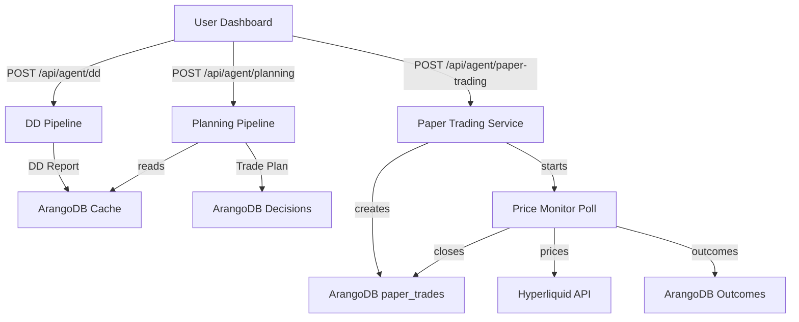

# Architecture

**Last Updated:** 2026-08-16

> System map, data flow, and service roles for Odin Agent.

---

## Overview

Odin Agent is organized into three layers: a React frontend dashboard, Next.js API routes that orchestrate agent pipelines, and a library of LLM-driven agents backed by ArangoDB graph memory and Hyperliquid market data.

---

## Flow / Sequence

---

## Service Roles

| Service | Role |
|---------|------|
| **Frontend Dashboard** | Asset input, DD trigger, plan generation, paper trade initiation. |
| **DD Agent** | Multi-factor swarm (technical, onchain, sentiment, fundamental) producing a scored report. |
| **Planning Agent** | Three-perspective swarm (conservative, balance, aggressive) that builds a deterministic trade plan from the DD report. |
| **Paper Trading Service** | Fire-and-forget price polling that detects TP/SL crosses and records simulated PnL. |
| **Graph Memory** | ArangoDB graph storing decisions, signals, outcomes, and cached DD reports for pattern learning. |
| **Hyperliquid Client** | Market data source: candles, mark price, funding, OI, user equity/balance. |

---

## Key Directories

| Path | Purpose |
|------|---------|
| `app/api/agent/*` | Next.js Route Handlers for DD, Planning, and Paper Trading. |
| `lib/agent/` | Agent orchestration, pipelines, subagents, tools, and shared utilities. |
| `lib/db/` | ArangoDB client, graph memory helpers, and risk threshold storage. |
| `lib/data/` | Hyperliquid and sentiment data fetchers. |
| `components/dashboard/` | Main UI sections (DD, Plan, Nav). |
| `context/` | React context for shared dashboard state. |
| `hooks/` | Client data-fetching hooks (`useDD`, `usePlanning`). |

---

## Related Docs

- [API](./API.md)
- [Deployment](./DEPLOYMENT.md)
- [Due Diligence Module](./modules/due-diligence.md)
- [Planning Module](./modules/planning.md)
- [Paper Trading Module](./modules/paper-trading.md)
- [Database Module](./modules/db.md)
- [Data Sources Module](./modules/data.md)
- [Frontend Module](./modules/frontend.md)
