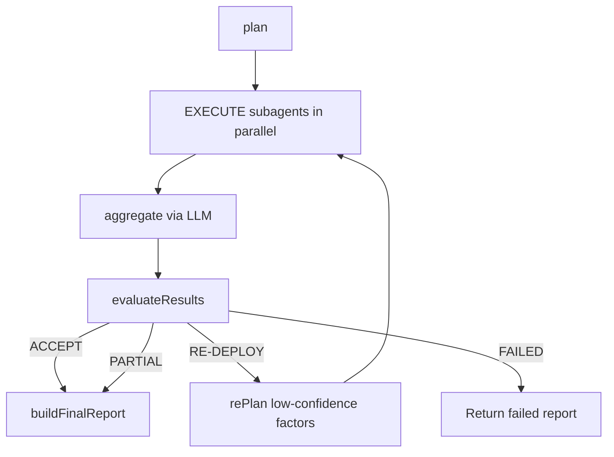

# Due Diligence Module

**Last Updated:** 2026-08-16

> Multi-factor swarm agent that analyzes a Hyperliquid asset and produces a scored DD report.

---

## Overview

The Due Diligence (DD) module runs a Plan-Execute-Reflect loop across four factor subagents: technical, onchain, sentiment, and fundamental. It aggregates their outputs via LLM, cross-validates signals, and returns a deterministic score and confidence.

---

## Flow / Sequence

---

## Files

### `lib/agent/due-diligence/agent.ts`

- Main orchestrator (`runDDAgent`).
- Runs up to 3 Plan-Execute-Reflect iterations with a 300s global timeout.
- Early-exits with partial report when 2+ factors fail.

### `lib/agent/due-diligence/subagent.ts`

- Deploys a single factor subagent with tool registry and timeout.

### `lib/agent/due-diligence/evaluate.ts`

- Decides ACCEPT, PARTIAL, RE-DEPLOY, or FAILED based on factor scores and cross-validation alignment.

### `lib/agent/due-diligence/llm.ts`

- `plan`, `rePlan`, `think`, `aggregate` — LLM prompts for orchestration and narrative synthesis.

### `lib/agent/due-diligence/prompts.ts`

- System prompt templates for the ReAct-style subagent loop.

### `lib/agent/due-diligence/tools/registry.ts`

- Maps factor names to tool sets (technical candles, onchain HL data, sentiment APIs, fundamental web search).

### `lib/agent/due-diligence/pipeline.ts`

- Thin wrapper (`runDDPipeline`) that calls `runDDAgent` and tracks timing.

---

## Key Functions / Classes / Exports

### `runDDAgent(params)`

- Orchestrates the full DD swarm.
- Returns `DDReport`.
- Fail-fast budgets: 120s per factor, 300s pipeline, max 3 loops.

### `buildFinalReport(params)`

- Assembles `DDReport` from factor reports, aggregation, deterministic scores, and metadata.
- Computes `usableFactorCount` (non-null scored factors).

### `computeDeterministicScore(factorReports)`

- Weighted average of scores by confidence; overall confidence is the minimum confidence among active factors.

---

## Data Models / Types

### `DDReport`

- `asset`: string
- `sections`: partial record of `technical`, `onchain`, `sentiment`, `fundamental`
- `overallScore`: number (0–100)
- `overallConfidence`: number (0–100)
- `status`: `"complete" | "partial" | "failed"`
- `usableFactorCount`: number

### `FactorReport`

- `factor`: `"technical" | "onchain" | "sentiment" | "fundamental"`
- `score`: number | null
- `confidence`: number
- `signals`: `{ name, strength }[]`
- `conclusion`: string

---

## Dependencies

- **Internal:** `lib/agent/shared/llm-client.ts` — DeepSeek client; `lib/db/graph-memory.ts` — DD report caching
- **External:** `arangojs`, `openai`, `@nktkas/hyperliquid`, `zod`

---

## Related Docs

- [Planning Module](./planning.md)
- [Database Module](./db.md)
- [API](../API.md)
