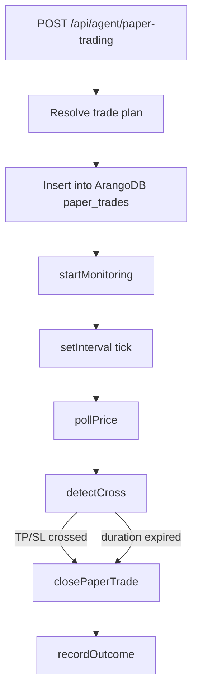

# Paper Trading Module

**Last Updated:** 2026-08-16

> Simulated trade monitoring that polls Hyperliquid prices and detects TP/SL crosses.

---

## Overview

The Paper Trading module persists trade plans to ArangoDB, then polls Hyperliquid prices at a fixed interval. It auto-closes trades when take-profit, stop-loss, or duration expiry is hit, and records outcomes to graph memory.

---

## Flow / Sequence

---

## Files

### `lib/agent/paper-trading/service.ts`

- Monitoring service: `pollPrice`, `detectCross`, `closePaperTrade`, `startMonitoring`, `stopMonitoring`.
- Active pollers are stored in an in-memory `Map` keyed by trade `_key`.

### `lib/agent/paper-trading/types.ts`

- Zod schemas and TypeScript types for paper trade lifecycle, price snapshots, and cross-detection.

### `app/api/agent/paper-trading/route.ts`

- API route that creates a paper trade. Accepts `planReport` to skip DD + Planning, or runs the full pipeline.

---

## Key Functions / Classes / Exports

### `startMonitoring(paperTradeKey)`

- Fire-and-forget interval that ticks every `POLL_INTERVAL_MS` (default 5 min).
- Stops automatically on TP/SL hit, expiry, or cancellation.

### `pollPrice(asset)`

- Fetches mid price from Hyperliquid via `allMids()`. Returns null on failure (skip tick, retry next interval).

### `detectCross(lastPrice, currentPrice, tp, sl, side)`

- Directional cross detection: long checks `>= TP` and `<= SL`; short inverts.
- Returns `fillPrice` on cross.

### `closePaperTrade(key, status, closedPrice)`

- Updates the ArangoDB record with closed price, PnL, and timestamp.
- Records outcome to graph memory via `recordOutcome`.

---

## Data Models / Types

### `PaperTrade`

- `_key?`: string
- `asset`, `userId`, `walletAddress`
- `side`: `"long" | "short" | "no_trade"`
- `entryPrice`, `stopLoss`, `takeProfit`, `leverage`, `positionSizeUsdc`
- `status`: `"active" | "tp_hit" | "sl_hit" | "expired" | "cancelled" | "no_trade"`
- `duration`: `"1h" | "5h" | "24h" | "3d" | "7d"`
- `pnlUsdc?`, `pnlPercent?`, `closedPrice?`, `closedAt?`

### `CrossDetectionResult`

- `tpCrossed`: boolean
- `slCrossed`: boolean
- `fillPrice?`: number

---

## Dependencies

- **Internal:** `lib/data/hyperliquid.ts` — price fetching; `lib/db/arango-client.ts` — persistence; `lib/db/graph-memory.ts` — outcome recording
- **External:** `arangojs`

---

## Notes / Edge Cases

- The poller is process-local. If the server restarts, active monitors are lost unless an external scheduler restarts them.
- A null price fetch skips the tick but keeps the poller alive.
- NO_TRADE plans are persisted immediately with `status: "no_trade"` and zero-size fields.

---

## Related Docs

- [Planning Module](./planning.md)
- [Database Module](./db.md)
- [API](../API.md)
