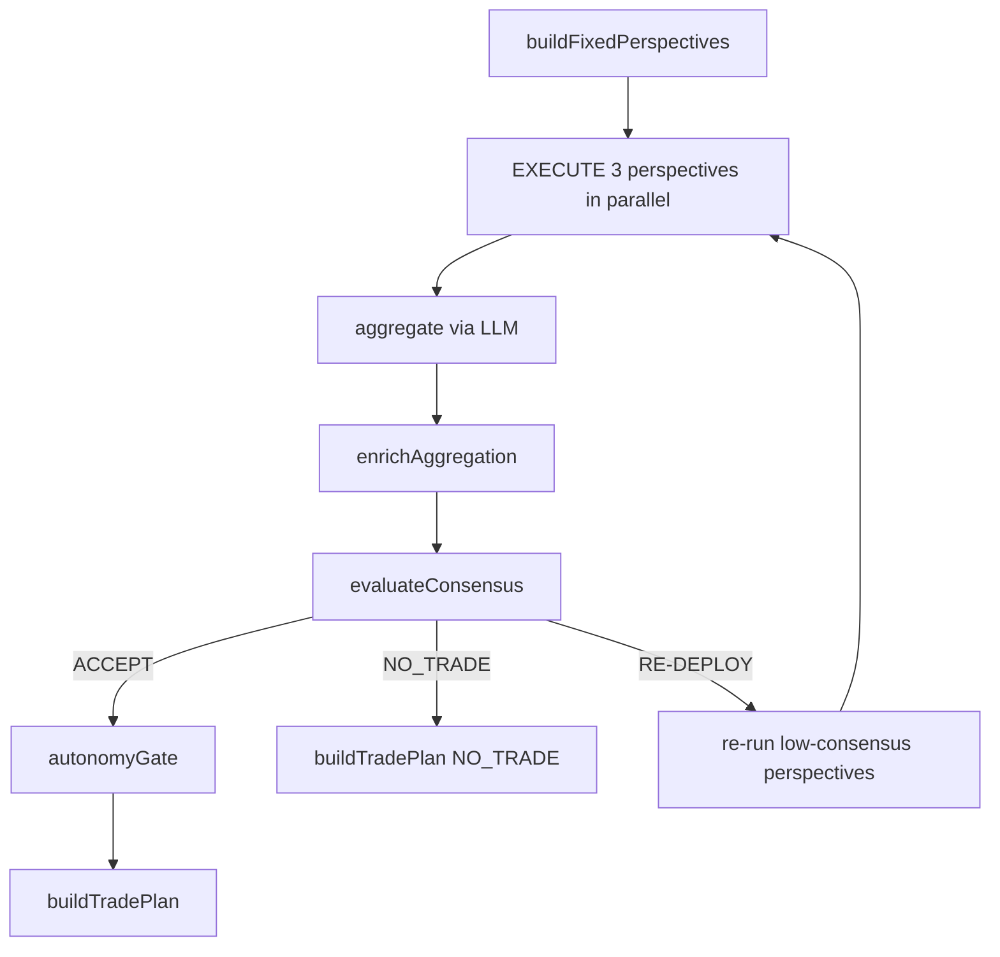

# Planning Module

**Last Updated:** 2026-08-16

> Three-perspective swarm agent that turns a DD report into a deterministic trade plan.

---

## Overview

The Planning module deploys conservative, balanced, and aggressive perspective subagents. It aggregates their narratives via LLM, evaluates consensus deterministically, and computes trade numbers (entry, SL, TP, size, leverage) in code — never from the LLM.

---

## Flow / Sequence

---

## Files

### `lib/agent/planning/agent.ts`

- Main orchestrator (`runPlanningAgent`).
- Pre-fetches equity, mark price, ATR, and risk thresholds once per run.
- Applies dynamic perspective weighting from graph memory history.
- Implements profit-target scaling (caps to 3×ATR and flags for approval).

### `lib/agent/planning/fixed-planner.ts`

- Deterministic planner that always emits 3 perspectives with static instruction templates.

### `lib/agent/planning/subagent.ts`

- Runs a single perspective subagent with the shared tool registry.

### `lib/agent/planning/evaluate.ts`

- `evaluateConsensus`: Layer 1 deterministic consensus over enriched aggregation.
- Returns ACCEPT, NO_TRADE, FAILED, or RE-DEPLOY with per-perspective breakdown.

### `lib/agent/planning/gate.ts`

- `autonomyGate`: Layer 2 gate. Decides `auto` vs `approve` based on confidence, position size, and thresholds.

### `lib/agent/planning/compute-trade-numbers.ts`

- Single source of trade geometry: entry, SL, TP, size, leverage from mark price, ATR, equity, and risk thresholds.

### `lib/agent/planning/consensus/weights.ts`

- Computes perspective weights from historical performance in graph memory. Falls back to uniform weights on cold start.

### `lib/agent/planning/pipeline.ts`

- Wrapper (`runPlanningPipeline`) that validates output with `TradePlanSchema` and computes `ddCoverage`.

---

## Key Functions / Classes / Exports

### `runPlanningAgent(params)`

- Orchestrates the planning swarm.
- Returns `{ report: TradePlan, timing, iterations, status, decisionPath, consensus? }`.
- Max 3 iterations; 300s loop timeout.

### `enrichAggregation(input)`

- Assembles final aggregation from LLM narrative + deterministic inputs.
- Computes confidence via `deterministicConfidence`, trade numbers via `computeTradeNumbers`, and profit feasibility.

### `buildTradePlan(params)`

- Builds the validated `TradePlan`. NO_TRADE encodes a zero-size placeholder position.
- Leverage is computed from ATR and confidence via the risk engine.

---

## Data Models / Types

### `TradePlan`

- `asset`, `side`, `action`: `"LONG" | "SHORT" | "NO_TRADE"`
- `entry_price`, `stop_loss`, `take_profit`: positive numbers
- `position_size_usdc`, `leverage`: positive numbers
- `confidence_score`: 0–100
- `autonomy_decision`: `"auto" | "approve"`
- `profit_target_scaled?`: boolean (Option B metadata)

### `PlanningAgentInput`

- `asset`, `userId`, `walletAddress`
- `ddReport`: `DDReport`
- `targetProfitPercent`: number (default 100)

---

## Dependencies

- **Internal:** `lib/agent/shared/risk-engine.ts`, `lib/agent/shared/deterministic-confidence.ts`, `lib/db/graph-memory.ts`, `lib/data/hyperliquid.ts`
- **External:** `openai`, `zod`

---

## Notes / Edge Cases

- All money numbers come from `computeTradeNumbers`. Any missing tool input forces `no_trade: true`.
- Profit target scaling: if user target > 3×ATR, the effective target is capped and the plan requires approval.
- Partial DD reports (usable < planned factors) apply a confidence penalty multiplier before the autonomy gate.

---

## Related Docs

- [Due Diligence Module](./due-diligence.md)
- [Paper Trading Module](./paper-trading.md)
- [API](../API.md)
